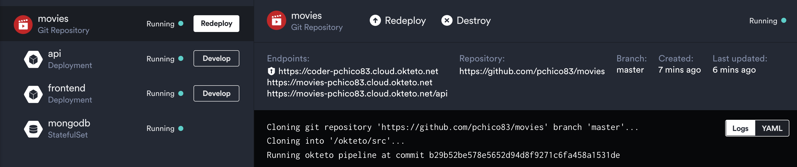
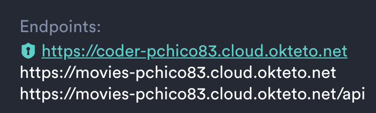
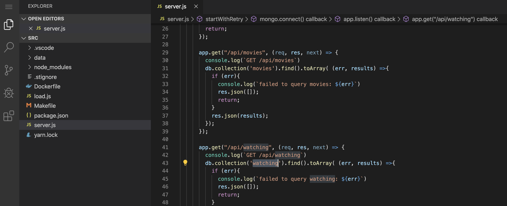
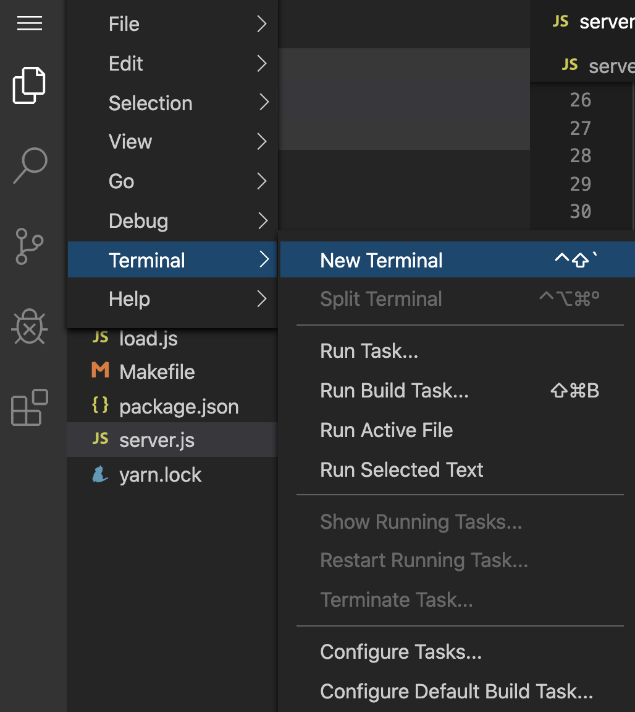
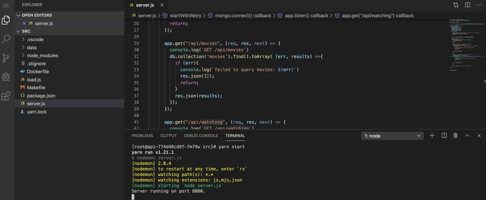
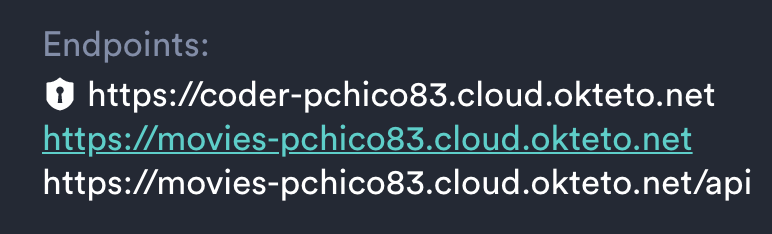

# Movies Sample app

This example shows how to develop a Node.js + React Sample App on Okteto Cloud. The Node + React Sample App is deployed using a [Helm Chart](https://github.com/okteto/movies/tree/master/chart). It creates the following components:

- A *React* based front-end, using [webpack](https://webpack.js.org) as bundler and *hot-reload server* for development.
- A very simple Node.js API using [Express](https://expressjs.com).
- A Coder.com IDE to develop the API component.
- A [MongoDB](https://www.mongodb.com) database.


## Step 1: Deploy the Movies App

Click on the next button to deploy the Movies App development environment:

[](https://cloud.okteto.com/deploy?repository=https://github.com/okteto/movies-cloudide)

When you deploy the Movies App Git repository, Okteto Cloud will run the deploy pipeline defined by the `okteto-pipeline.yml` of the repository.
In this case, the pipeline deploys the chart of the Movies App with Helm.

Your application will be ready to go once its components reach the `Running` state.



The Okteto Cloud dashboard is designed to be developer friendly, it gives you instant feedback about your applications logs, errors, metrics and more.

## Step 2: Access your Online IDE

Now click on the coder's endpoint of the api component to access the Coder.com IDE:



 You should see something like this:



Open a terminal in the Coder.com IDE:



And execute `yarn start` to run the application:



Now your application is running, go back to the Okteto Cloud dashboard and click on the endpoint of the frontend component:



Cool no 😎? But ooh... seems like we have a bug in our application:


The list of *Movies* and the list of *Continue watching for Cindy* are the same. Let us work on a fix now!

## Step 3: Development time!

Let's fix the bug of the Movies App.
Open the `server.js` file in the Coder.com IDE modify the line 41 to query the `watching` collection instead of `movies`:


Save your changes. Take a look at the Coder.com shell and notice how the changes are detected by `nodemon` and automatically hot reloaded.

```console
[nodemon] restarting due to changes...
[nodemon] starting `node server.js`
Server running on port 8080.
```

Go back to the browser, and reload the Movies App. Your code fixes were instantly applied in a realistic development environment!

## Next steps

Congratulations, you just developed **your first application in Okteto Cloud** 🚀.

> Okteto lets you develop your applications directly in Kubernetes. This way you can:
> - Eliminate integration issues by developing in a realistic environment
> - Test your application end to end as fast as you type code
> - No more CPU cycles wasted in your machine. Develop at the speed of the cloud!

Ready to develop your application on Okteto Cloud? Read our [step by step tutorial](/docs/tutorials/getting-started-with-pipelines) on how to configure an Okteto Pipeline to deploy realistic environments for your application in just one click. 
